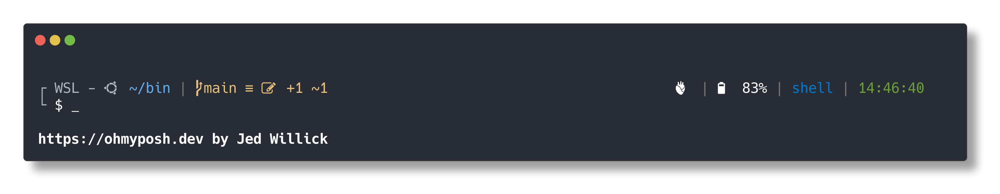

## One Dark Oh My Posh Theme



My take on a One Dark style theme for [Oh My Posh](https://ohmyposh.dev/)

### Linux

```bash
wget https://raw.githubusercontent.com/JedWillick/onedark-omp/main/onedark.omp.json -O ~/.poshthemes/onedark.omp.json
```

For `bash` add the following to `~/.bashrc`

```sh
eval "$(oh-my-posh --init --shell bash --config ~/.poshthemes/onedark.omp.json)"
```

Or if using `zsh` add to `~/.zshrc`

```sh
eval "$(oh-my-posh --init --shell zsh --config ~/.poshthemes/onedark.omp.json)"
```


### PowerShell

```powershell
Invoke-WebRequest https://raw.githubusercontent.com/JedWillick/onedark-omp/main/onedark.omp.json -OutFile $env:POSH_THEMES_PATH\onedark.omp.json
```

Then add the following to `$PROFILE`

```powershell
Import-Module oh-my-posh
$env:POSH_GIT_ENABLED = $true
Set-PoshPrompt -Theme $env:POSH_THEMES_PATH\onedark.omp.json
```


### More

For a comprehensive guide visit https://ohmyposh.dev/docs/
